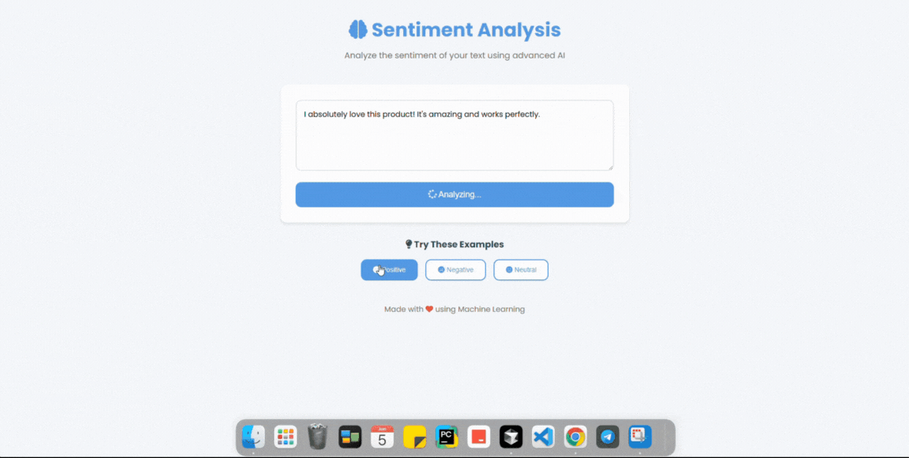

# Sentiment Analysis — Decoding Human Emotion Through Code

In a digital age teeming with voices, understanding sentiment isn't just beneficial—it's essential. This project transforms raw text into meaningful insights, bridging the gap between human emotion and machine interpretation.

##  Project Overview

This repository presents a streamlined approach to sentiment analysis, utilizing machine learning techniques to classify text data into positive, negative, or neutral sentiments. It's designed for clarity, efficiency, and adaptability.

##  Features

- **Data Preprocessing**: Clean and prepare textual data for analysis.
- **Model Training**: Implement machine learning algorithms to learn from data.
- **Model Serialization**: Save trained models for future use.
- **Interactive Interface**: Deploy a user-friendly interface for real-time sentiment prediction.

##  Repository Structure

```

Sentiment-analysis/
├── DataSet/           # Contains the dataset used for training and testing
├── Model/             # Serialized machine learning models
├── WebSite/           # Streamlit app for user interaction
├── LICENSE            # Project license
├── OutPut.gif         # Demonstration of the app in action
└── README.md          # Project documentation

```

## 🚀 Getting Started

1. **Clone the repository**:
   ```bash
   git clone https://github.com/AdilShamim8/Sentiment-analysis.git
   cd Sentiment-analysis
```

2. **Install dependencies**:
   Ensure you have the necessary Python packages installed. You can use `pip` to install them:

   ```bash
   pip install -r requirements.txt
   ```

3. **Run the Streamlit app**:
   Navigate to the `WebSite` directory and launch the app:

   ```bash
   streamlit run app.py
   ```

##  How It Works

* **Data Processing**: The dataset is cleaned and preprocessed to remove noise and irrelevant information.
* **Model Training**: Machine learning models are trained on the processed data to learn patterns associated with different sentiments.
* **Prediction**: The trained model predicts the sentiment of new, unseen text inputs.
* **User Interface**: A Streamlit-based web app allows users to input text and receive sentiment predictions in real-time.

##  Demonstration



Experience the seamless interaction and instant feedback provided by the application.

##  Technologies Used

* **Python**: Core programming language for data processing and model implementation.
* **Scikit-learn**: Machine learning library for model training and evaluation.
* **Streamlit**: Framework for building interactive web applications.
* **Jupyter Notebook**: Environment for exploratory data analysis and model development.

##  License

This project is licensed under the [MIT License](LICENSE), allowing for open collaboration and distribution.

---

Crafted with precision and a passion for innovation by **Adil Shamim**.
